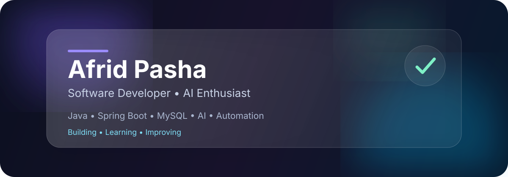
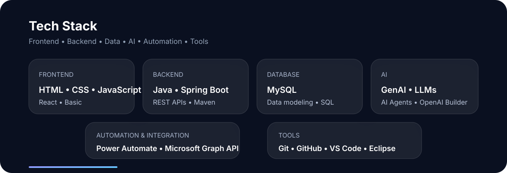
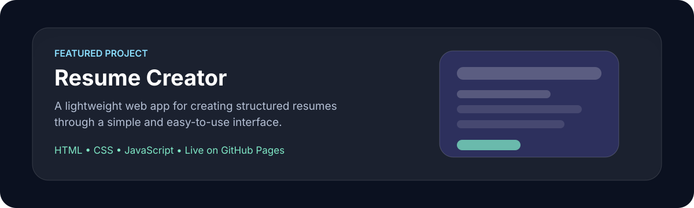

 

 

## ✨ About Me

I'm a software developer passionate about building scalable backend applications, solving complex engineering problems, and exploring practical applications of AI and automation.

- 💻 Working primarily with **Java, Spring Boot, MySQL & REST APIs**
- 🎨 Comfortable with **HTML, CSS & JavaScript**
- ⚛️ Familiar with **React at a basic level**
- ⚡ Interested in **backend performance optimization**
- 🤖 Exploring **Generative AI, LLMs & AI Agents**, with hands-on exposure to the **OpenAI Agent Builder platform**
- ⚙️ Building automated workflows with **Microsoft Power Automate**
- 🔗 Exploring integrations with **Microsoft Graph API**
- 🏗️ Learning more about **System Design & scalable architecture**
- 🧩 I enjoy debugging, optimization, and solving challenging engineering problems

 

 

## 🛠️ Tech Stack

### Frontend

### Backend

### Database

### AI

### Automation & Integration

### Tools

 

## 🚀 Featured Project

 

## 💡 Areas of Interest

`Backend Engineering` • `Frontend Fundamentals` • `System Design` • `Artificial Intelligence` • `Automation` • `API Integration`

 

I'm particularly interested in exploring how **AI and automation can complement backend engineering** to build smarter, scalable, and more efficient software systems.

 

## 🌱 Currently Exploring

| Area | Focus |
|---|---|
| 🤖 AI Agents | Agentic workflows, intelligent automation & OpenAI Agent Builder |
| 🧠 LLMs | Practical integration with software systems |
| ⚛️ React | Strengthening frontend fundamentals |
| 🔗 Integrations | AI + Backend + Microsoft Graph |
| ⚙️ Automation | Power Automate & workflow orchestration |
| 🏗️ System Design | Scalable backend architecture |
| ⚡ Performance | Efficient backend processing |

 

## 🎯 Engineering Focus

 

  

**Building • Learning • Improving** 🚀

