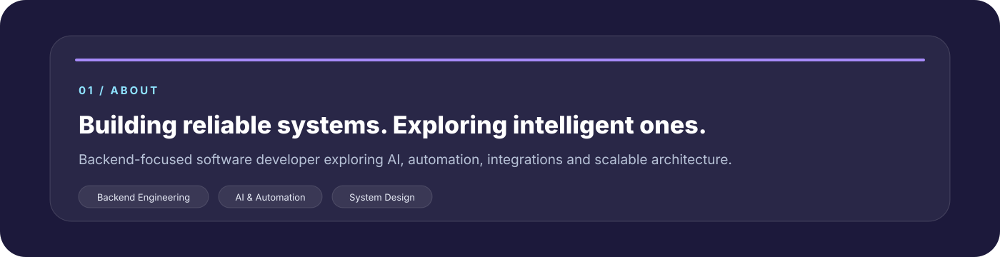
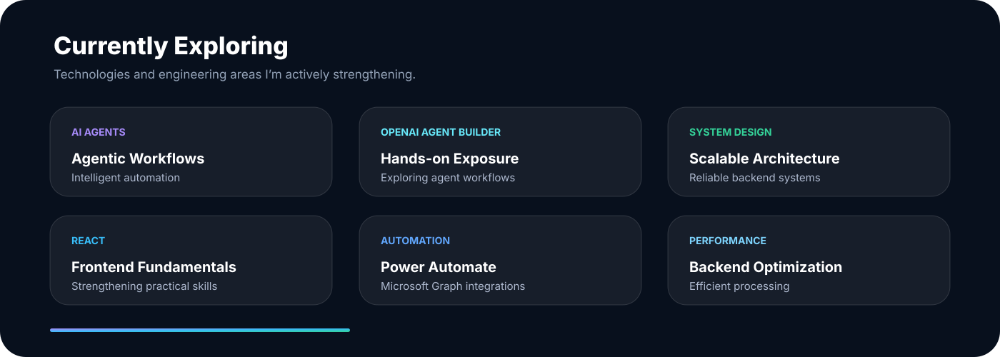

  

 

 

 

## 03 / Featured Build

 

 

## 05 / Engineering Mindset

### `BUILD` → `MEASURE` → `OPTIMIZE` → `LEARN` → `REPEAT`

 

`Backend Engineering`　•　`System Design`　•　`Performance Optimization`

`AI Integration`　•　`Automation`　•　`Clean Code`

 

  

**⚡ Always learning. Always building.**

